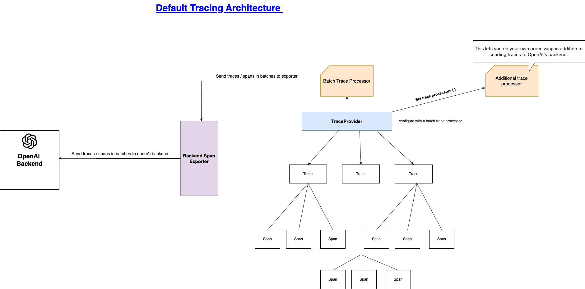

# Tracing:

Collecting comprehensive record of events occur during an agent run, 
- LLM generations
- Tool calls 
- Handoffs 
- Guardrails
- Custom events that occur 

## High level Tracing Architecture:
  
*The default high level architecture for tracing*

## Adding Custom or external Trace Processors 

You can add custom trace processor by using add_trace_processor() and replace the default processor using set_trace_processors() with your own trace processor if you
added one OR you can add external trace processor other than openAI e.g. BrainTrust.
BrainTrust is External Trace Processor for OpenAI and other Agents

### Steps to integrate BrainTrust as external trace processor:

- Create an account on Braintrust and make a project there.
- Get an API key & set it as an environment variable of your project. BRAINTRUST_API_KEY=..
- Install the required packages: "uv add braintrust"
- Add the code as in brain_trust.py 

## Notes:
https://docs.google.com/document/d/1WiqSGoCSW6zwBAJi7XqMaADvU2y6uv7O0K5WjU0WLVo/edit?usp=sharing

